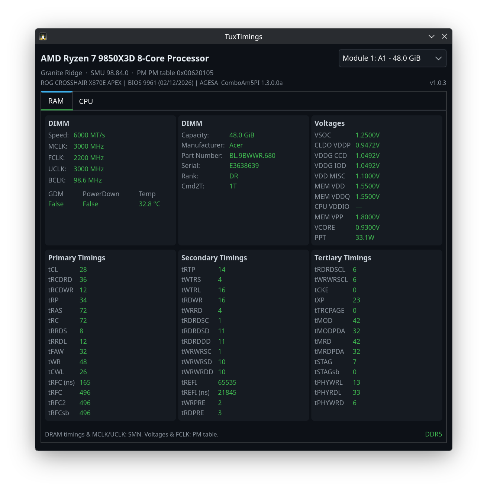

# TuxTimings



### Supported CPUs

At the moment, **only Zen 5 Granite Ridge desktop CPUs** (e.g. Ryzen 9000‑series AM5) are fully supported for PM‑table based telemetry. Other AMD families may start, but sensors and timings are not guaranteed to be correct yet.

### Prerequisites

- **[ryzen_smu](https://github.com/amkillam/ryzen_smu/)** kernel module — build and load before running TuxTimings
- **GTK4** development libraries (`gtk4-devel` / `libgtk-4-dev`)
- **gcc**, **make**, **pkg-config**

### Building & Installing

```bash
cd Linux
./install.sh
```

This will compile the C/GTK4 binary, package it as an AppImage, and install to `/opt/TuxTimings/` with a polkit policy, desktop file, and icon. Root privileges are requested automatically via sudo.

To build without installing:

```bash
cd Linux
make
sudo ./tuxtimings
```

### License

This project is licensed under the **GNU General Public License v3.0**. See [LICENSE](LICENSE) for the full text.

### References and projects used

- **[ryzen_smu](https://github.com/amkillam/ryzen_smu/)** — Kernel module for reading AMD SMN and PM table; build and load separately at runtime.
- **[ZenStates-Core](https://github.com/irusanov/ZenStates-Core)** — PM table offsets and timing formulas (reimplemented in our Linux backend; used with permission).
- **[ZenTimings](https://github.com/nickspacewalker/ZenTimings)** — Windows version; TuxTimings is based on this concept.
- **[GTK4](https://gtk.org/)** — Native Linux UI toolkit.
- **[Linux kernel](https://github.com/torvalds/linux)** — SMN/sysfs interface and platform support.
- **[AMD's public documentation](https://www.amd.com/en/support/tech-docs)** — SMN/PM table and DRAM timing references.
- **[AppImageKit](https://github.com/AppImage/AppImageKit)** — Used to build the AppImage.
- **Tux icon** — Tux the penguin originally by Larry Ewing, created with GIMP (`lewing@isc.tamu.edu`), used and/or modified under the terms of the original image permission.

Huge credit goes to ZenTimings and irusanov — without his project this wouldn't be possible.
